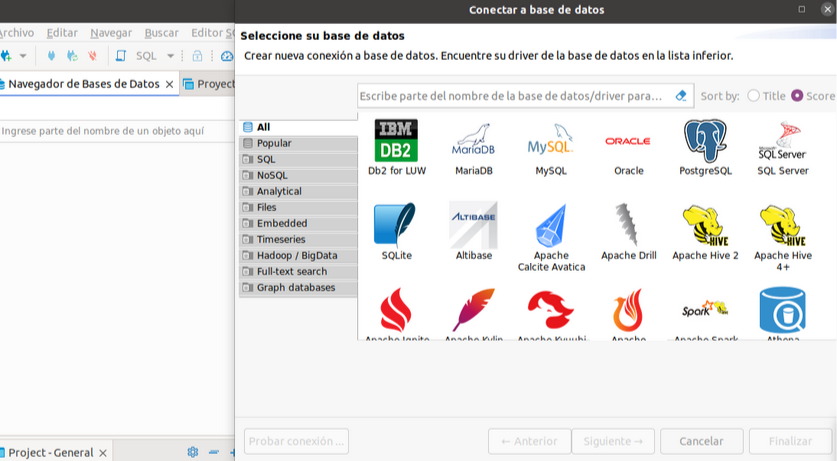

# ProyectoDB
Ejercicio extra 2: Práctica extra en GitHub con Docker y PostgreSQL 

# 📌 ProyectoDB - Documentación Oficial

🔗 **Repositorio en GitHub**: [ProyectoDB](https://github.com/CristianJoseMoreno/ProyectoDB)  

---

# 🎯 Objetivos de la práctica

- *Crear y gestionar un repositorio en GitHub**  
- *Trabajar con ramas, commits y rollback de cambios en Git**  
- *Configurar y levantar un contenedor PostgreSQL usando Docker**  
- *Conectarse a la base de datos desde un gestor como DBeaver**  
- *Diseñar un Diagrama Entidad-Relación (ERD) para una clínica de acupuntura**

# 📝 Paso 1: Crear un nuevo repositorio en GitHub

- Abre una terminal y navega a la carpeta donde quieres crear el repositorio:

```bash
mkdir ProyectoDB
cd ProyectoDB
```

- Inicializa Git en la carpeta:

```bash
git init
```

- Crea un archivo README.md:
```bash
echo "# ProyectoDB" > README.md
```

- Agrega los archivos al repositorio:

```bash
git add .
git commit -m "Initial commit"
```

- Conéctalo a GitHub:

```bash
git remote add origin https://github.com/CristianJoseMoreno/ProyectoDB.git
```

- Sube los archivos a GitHub:

```bash
git push -u origin main
```


# 🖥️ Paso 2: Clonar el repositorio en tu máquina local

1. Clonamos el repositorio de GitHub a la máquina local usando:

   ```bash
   git clone https://github.com/CristianJoseMoreno/ProyectoDB.git
   cd ProyectoDB

# ⚙️ Paso 3: Crear un proyecto sencillo de base de datos con Docker y PostgreSQL

Ahora vamos a crear un archivo `docker-compose.yml` para levantar un contenedor con PostgreSQL. En el mismo incluimos:

```yaml
services:
  db:
	image: postgres:latest
	environment:
	POSTGRES_USER: user
	POSTGRES_PASSWORD: password
	POSTGRES_DB: proyectodb
	ports:
	- "5432:5432"
	volumes:
	- proyectodb_postgres-data:/var/lib/postgresql/data

volumes:
  proyectodb_postgres-data:
	external: true
```
Se han hecho los siguientes cambios a la estructura indicada en la tarea:

- **Se ha eliminado la versión**: Al dar un error por ello (detallado en el apartado errores)
- **Se ha agregado en volumes el atributo external:true**: Avisa a Docker compose que usa un volumen ya existente, ya que si no perdía la persistencia al cerrar DBeaver (detallado en el apartado errores)


# 🚀 Paso 4: Levantar el contenedor PostgreSQL con Docker

## Preparación

Antes de iniciar el contenedor, tenemos que estar dentro de la carpeta de tu repositorio **ProyectoDB**, si no navega hacia ella.  

```bash
cd /<TU RUTA>
##Iniciar el contenedor
Ejecuta el siguiente comando para levantar el contenedor en segundo plano:
```bash
docker-compose up -d
```

Con este comando nos descargamos la imagen si no la tuviésemos ya y ejecutaremos un contenedor con la base de datos configurada.
Para comprobar que el contenedor se ha iniciado correctamente, usa:
```bash
docker ps
```


# 🧑‍💻 Paso 5: Trabajar con ramas, commits y rollback en Git

##  Crear y gestionar ramas

Se creó una nueva rama para trabajar en los cambios:

```bash
git checkout -b v


## Realizar commits

Después de editar el archivo `docker-compose.yml`, se realizaron los siguientes pasos:  
- **Agregar cambios al área de staging**:  
```bash  
git add .  
```  
- **Crear un commit**:  
```bash  
git commit -m "feat(database): add PostgreSQL setup with Docker Compose"  
```

## Push de la rama a GitHub

Subimos la nueva rama a GitHub:  
```bash  
git push -u origin feature/database-setup  
```

## Hacer rollback de cambios

Después de experimentar con un `git reset` y cometer algunos errores (que se incluyen en el apartado errores), recuperamos el archivo `docker-compose.yml` usando el comando:  
```bash  
git reset --hard HEAD~1  
```  
Posteriormente, lo agregamos de nuevo, cometimos los cambios y subimos la rama a GitHub.

# 🌐 Paso 6: Conectar PostgreSQL con DBeaver

Iniciamos la aplicación donde creamos la base de datos seleccionando Postgree:



Se conectó a PostgreSQL desde DBeaver utilizando las siguientes credenciales:

- **Host**: localhost  
- **Port**: 5432  
- **Database**: proyectodb  
- **User**: user  
- **Password**: password

Se verificó que la conexión fuera exitosa en el propio launcher.


# 🗂️ Paso 7: Crear un Diagrama Entidad-Relación (ERD)

Se diseñó el esquema de la base de datos para una clínica de acupuntura, incluyendo las siguientes tablas:

- **CLIENTE** Información personal del cliente.  
- **CITA** Detalles de cada cita, con relación al cliente y al personal que atiende.  
- **PAGO** Relación con la cita y el personal que cobró el pago.  
- **STAFF** Información del personal que atiende a los clientes.

### 🔗 Explicacion de relaciones:
- Un **cliente** puede tener múltiples **citas**.  
- Cada **cita** está relacionada con un miembro del **staff**.  
- Un **pago** se asocia a una **cita** y es realizado por un miembro del **staff**.

El diagrama fue realizado en **DBeaver** y refleja correctamente las relaciones entre las tablas:


# ⬆️ Paso 8: Subir los cambios a GitHub

Una vez finalizados los cambios en la base de datos,  hacemos el merge de la rama `feature/database-setup` a `main`.  

Realizamos los siguientes pasos para el merge:  
- Cambio a la rama `main`:  
```bash  
git checkout main  
```  
- Pull de los últimos cambios en `main`:  
```bash  
git pull origin main  
```  
- Merge de la rama `feature/database-setup` a `main`:  
```bash  
git merge feature/database-setup  
```  
- Subir los cambios a GitHub:  
```bash  
git push origin main  
```

# ⚠️ Errores Cometidos y Soluciones

## ❌ Error 1: No se podía hacer push debido a un commit en la rama remota

- **Descripción del error:**  
  Al intentar hacer un `git push`, se recibió el error de que la rama local estaba detrás de la rama remota.  

- **Solución:**  
  Realizamos un `git pull` para obtener los cambios de la rama remota antes de hacer el push.

---

## ❌ Error 2: Uso de `git reset` y pérdida de cambios

- **Descripción del error:**  
  Al hacer un `git reset --hard HEAD~1`, se perdió el archivo `docker-compose.yml`, que no había sido respaldado.  

- **Solución:**  
  Se recuperó el archivo añadiendo nuevamente el mismo, confirmando los cambios y volviéndolo a subir.

---

## ❌ Error 3: Conexión a DBeaver no visible

- **Descripción del error:**  
  DBeaver no mostraba la base de datos después de configurarla.  

- **Solución:**  
  Se verificaron las credenciales, se revisó la configuración de conexión y se probó nuevamente hasta que se estableció correctamente.

—

## ❌ Error 4: Pérdida de la base de datos al cerrar DBeaver  

- **Descripción del error:**  
  Al cerrar DBeaver y volver a abrirlo, la base de datos desaparecía, indicando que los datos no eran persistentes.  

- **Solución:**  
  Se modificó el `docker-compose.yml` agregando `external: true` en `volumes` para asegurarse de que Docker reconociera un volumen persistente.

—

## ❌ Error 5: Volumen de Docker no encontrado  

- **Descripción del error:**  
  Al intentar inspeccionar el volumen con `docker volume inspect postgres-data`, se obtuvo el mensaje `no such volume`.  

- **Solución:**  
  Se cambió el nombre del volumen en `docker-compose.yml` para que coincidiera con el generado por Docker y se recreó el contenedor correctamente.

---

## ❌ Error 6: `docker-compose` arrojaba advertencias sobre la versión

- **Descripción del error:**  
  Al ejecutar `docker-compose up -d`, se mostró una advertencia indicando que el atributo `version` era obsoleto.  

- **Solución:**  
  Se eliminó la línea `version` del `docker-compose.yml`, ya que no era necesaria en versiones recientes de Docker Compose.

---

## ❌ Error 8: `docker-compose down` fallaba debido a un volumen no definido  

- **Descripción del error:**  
  Al ejecutar `docker-compose down`, se recibió el mensaje `service "db" refers to undefined volume postgres-data: invalid compose project`.  

- **Solución:**  
  Se definió correctamente el volumen en `docker-compose.yml` asegurándose de que existiera antes de usarlo.

---
